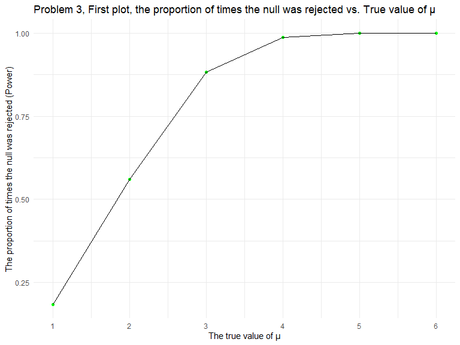
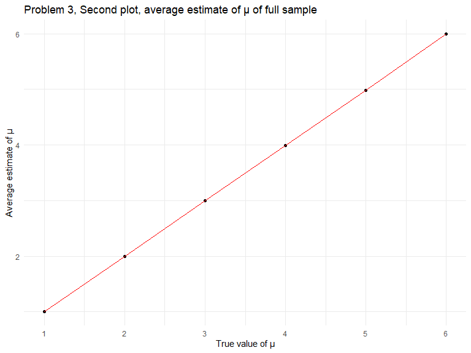
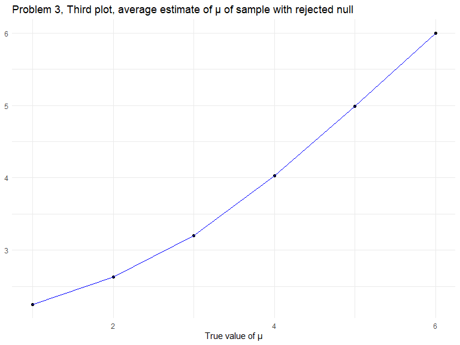

HW5
================
Soungbin Yim
2022-11-15

### Due date

Due: November 16 at 11:59pm.

### Points

| Problem         | Points    |
|:----------------|:----------|
| Problem 0       | 20        |
| Problem 1       | –         |
| Problem 2       | 40        |
| Problem 3       | 40        |
| Optional survey | No points |

### Problem 0

This “problem” focuses on structure of your submission, especially the
use git and GitHub for reproducibility, R Projects to organize your
work, R Markdown to write reproducible reports, relative paths to load
data from local files, and reasonable naming structures for your files.
This was not prepared as a GitHub repo.

``` r
library(tidyverse)
```

## Problem 2

Describe the raw data. Create a city_state variable (e.g. “Baltimore,
MD”) and then summarize within cities to obtain the total number of
homicides and the number of unsolved homicides (those for which the
disposition is “Closed without arrest” or “Open/No arrest”).

``` r
homicide_df =
  read_csv("./homicide-data.csv") %>%
  mutate(
    victim_age = recode(victim_age,"Unknown" = ""),
    victim_age = as.numeric(victim_age),
    city_state = str_c(city, ", ", state)
  ) %>%
  group_by(city_state) %>%
  summarize(unsolved_sum = sum(disposition == "Closed without arrest", disposition == "Open/No arrest"),
    total_homicide = n()) 
```

    ## Rows: 52179 Columns: 12
    ## ── Column specification ────────────────────────────────────────────────────────
    ## Delimiter: ","
    ## chr (9): uid, victim_last, victim_first, victim_race, victim_age, victim_sex...
    ## dbl (3): reported_date, lat, lon
    ## 
    ## ℹ Use `spec()` to retrieve the full column specification for this data.
    ## ℹ Specify the column types or set `show_col_types = FALSE` to quiet this message.

The raw data has `51` observations and `3` variables. The `victim_age`
variable had some missing observations with `Unknown`, so I substituted
with `NA` and changed the variable as numeric with `as.numeric`.

The following table shows the total number of homicides and the number
of unsolved homicides for each city:

| city_state         | unsolved_sum | total_homicide |
|:-------------------|-------------:|---------------:|
| Albuquerque, NM    |          146 |            378 |
| Atlanta, GA        |          373 |            973 |
| Baltimore, MD      |         1825 |           2827 |
| Baton Rouge, LA    |          196 |            424 |
| Birmingham, AL     |          347 |            800 |
| Boston, MA         |          310 |            614 |
| Buffalo, NY        |          319 |            521 |
| Charlotte, NC      |          206 |            687 |
| Chicago, IL        |         4073 |           5535 |
| Cincinnati, OH     |          309 |            694 |
| Columbus, OH       |          575 |           1084 |
| Dallas, TX         |          754 |           1567 |
| Denver, CO         |          169 |            312 |
| Detroit, MI        |         1482 |           2519 |
| Durham, NC         |          101 |            276 |
| Fort Worth, TX     |          255 |            549 |
| Fresno, CA         |          169 |            487 |
| Houston, TX        |         1493 |           2942 |
| Indianapolis, IN   |          594 |           1322 |
| Jacksonville, FL   |          597 |           1168 |
| Kansas City, MO    |          486 |           1190 |
| Las Vegas, NV      |          572 |           1381 |
| Long Beach, CA     |          156 |            378 |
| Los Angeles, CA    |         1106 |           2257 |
| Louisville, KY     |          261 |            576 |
| Memphis, TN        |          483 |           1514 |
| Miami, FL          |          450 |            744 |
| Milwaukee, wI      |          403 |           1115 |
| Minneapolis, MN    |          187 |            366 |
| Nashville, TN      |          278 |            767 |
| New Orleans, LA    |          930 |           1434 |
| New York, NY       |          243 |            627 |
| Oakland, CA        |          508 |            947 |
| Oklahoma City, OK  |          326 |            672 |
| Omaha, NE          |          169 |            409 |
| Philadelphia, PA   |         1360 |           3037 |
| Phoenix, AZ        |          504 |            914 |
| Pittsburgh, PA     |          337 |            631 |
| Richmond, VA       |          113 |            429 |
| Sacramento, CA     |          139 |            376 |
| San Antonio, TX    |          357 |            833 |
| San Bernardino, CA |          170 |            275 |
| San Diego, CA      |          175 |            461 |
| San Francisco, CA  |          336 |            663 |
| Savannah, GA       |          115 |            246 |
| St. Louis, MO      |          905 |           1677 |
| Stockton, CA       |          266 |            444 |
| Tampa, FL          |           95 |            208 |
| Tulsa, AL          |            0 |              1 |
| Tulsa, OK          |          193 |            583 |
| Washington, DC     |          589 |           1345 |

For the city of Baltimore, MD, use the prop.test function to estimate
the proportion of homicides that are unsolved; save the output of
prop.test as an R object, apply the broom::tidy to this object and pull
the estimated proportion and confidence intervals from the resulting
tidy dataframe.

``` r
baltimore_df = 
  homicide_df %>%
  filter(city_state %in% c("Baltimore, MD"))

Prop_baltimore_df =
  prop.test(baltimore_df$unsolved_sum,baltimore_df$total_homicide,
    alternative = c("two.sided"),
    conf.level = 0.95, correct = TRUE) %>%
  broom::tidy()

Prop_baltimore_df %>%
  select(estimate, "CI_lower" = conf.low, "CI_upper" = conf.high)
```

    ## # A tibble: 1 × 3
    ##   estimate CI_lower CI_upper
    ##      <dbl>    <dbl>    <dbl>
    ## 1    0.646    0.628    0.663

Now run prop.test for each of the cities in your dataset, and extract
both the proportion of unsolved homicides and the confidence interval
for each. Do this within a “tidy” pipeline, making use of purrr::map,
purrr::map2, list columns and unnest as necessary to create a tidy
dataframe with estimated proportions and CIs for each city.

``` r
 prop.test(homicide_df$unsolved_sum,homicide_df$total_homicide,
    alternative = c("two.sided"),
    conf.level = 0.95, correct = TRUE) %>%
  broom::tidy()
```

    ## # A tibble: 1 × 56
    ##   estimate1 estimate2 estimate3 estima…¹ estim…² estim…³ estim…⁴ estim…⁵ estim…⁶
    ##       <dbl>     <dbl>     <dbl>    <dbl>   <dbl>   <dbl>   <dbl>   <dbl>   <dbl>
    ## 1     0.386     0.383     0.646    0.462   0.434   0.505   0.612   0.300   0.736
    ## # … with 47 more variables: estimate10 <dbl>, estimate11 <dbl>,
    ## #   estimate12 <dbl>, estimate13 <dbl>, estimate14 <dbl>, estimate15 <dbl>,
    ## #   estimate16 <dbl>, estimate17 <dbl>, estimate18 <dbl>, estimate19 <dbl>,
    ## #   estimate20 <dbl>, estimate21 <dbl>, estimate22 <dbl>, estimate23 <dbl>,
    ## #   estimate24 <dbl>, estimate25 <dbl>, estimate26 <dbl>, estimate27 <dbl>,
    ## #   estimate28 <dbl>, estimate29 <dbl>, estimate30 <dbl>, estimate31 <dbl>,
    ## #   estimate32 <dbl>, estimate33 <dbl>, estimate34 <dbl>, estimate35 <dbl>, …
    ## # ℹ Use `colnames()` to see all variable names

``` r
prop_homicide_df =
  homicide_df %>%
  mutate(proportion = purrr::map2(unsolved_sum,total_homicide,prop.test),
         proportion = purrr::map(proportion, broom::tidy)) %>%
  unnest(proportion) %>%
  select(1:4,8,9)
```

The estimated proportions and CIs for each city:

| city_state         | unsolved_sum | total_homicide |  estimate |  conf.low | conf.high |
|:-------------------|-------------:|---------------:|----------:|----------:|----------:|
| Albuquerque, NM    |          146 |            378 | 0.3862434 | 0.3372604 | 0.4375766 |
| Atlanta, GA        |          373 |            973 | 0.3833505 | 0.3528119 | 0.4148219 |
| Baltimore, MD      |         1825 |           2827 | 0.6455607 | 0.6275625 | 0.6631599 |
| Baton Rouge, LA    |          196 |            424 | 0.4622642 | 0.4141987 | 0.5110240 |
| Birmingham, AL     |          347 |            800 | 0.4337500 | 0.3991889 | 0.4689557 |
| Boston, MA         |          310 |            614 | 0.5048860 | 0.4646219 | 0.5450881 |
| Buffalo, NY        |          319 |            521 | 0.6122841 | 0.5687990 | 0.6540879 |
| Charlotte, NC      |          206 |            687 | 0.2998544 | 0.2660820 | 0.3358999 |
| Chicago, IL        |         4073 |           5535 | 0.7358627 | 0.7239959 | 0.7473998 |
| Cincinnati, OH     |          309 |            694 | 0.4452450 | 0.4079606 | 0.4831439 |
| Columbus, OH       |          575 |           1084 | 0.5304428 | 0.5002167 | 0.5604506 |
| Dallas, TX         |          754 |           1567 | 0.4811742 | 0.4561942 | 0.5062475 |
| Denver, CO         |          169 |            312 | 0.5416667 | 0.4846098 | 0.5976807 |
| Detroit, MI        |         1482 |           2519 | 0.5883287 | 0.5687903 | 0.6075953 |
| Durham, NC         |          101 |            276 | 0.3659420 | 0.3095874 | 0.4260936 |
| Fort Worth, TX     |          255 |            549 | 0.4644809 | 0.4222542 | 0.5072119 |
| Fresno, CA         |          169 |            487 | 0.3470226 | 0.3051013 | 0.3913963 |
| Houston, TX        |         1493 |           2942 | 0.5074779 | 0.4892447 | 0.5256914 |
| Indianapolis, IN   |          594 |           1322 | 0.4493192 | 0.4223156 | 0.4766207 |
| Jacksonville, FL   |          597 |           1168 | 0.5111301 | 0.4820460 | 0.5401402 |
| Kansas City, MO    |          486 |           1190 | 0.4084034 | 0.3803996 | 0.4370054 |
| Las Vegas, NV      |          572 |           1381 | 0.4141926 | 0.3881284 | 0.4407395 |
| Long Beach, CA     |          156 |            378 | 0.4126984 | 0.3629026 | 0.4642973 |
| Los Angeles, CA    |         1106 |           2257 | 0.4900310 | 0.4692208 | 0.5108754 |
| Louisville, KY     |          261 |            576 | 0.4531250 | 0.4120609 | 0.4948235 |
| Memphis, TN        |          483 |           1514 | 0.3190225 | 0.2957047 | 0.3432691 |
| Miami, FL          |          450 |            744 | 0.6048387 | 0.5685783 | 0.6400015 |
| Milwaukee, wI      |          403 |           1115 | 0.3614350 | 0.3333172 | 0.3905194 |
| Minneapolis, MN    |          187 |            366 | 0.5109290 | 0.4585150 | 0.5631099 |
| Nashville, TN      |          278 |            767 | 0.3624511 | 0.3285592 | 0.3977401 |
| New Orleans, LA    |          930 |           1434 | 0.6485356 | 0.6231048 | 0.6731615 |
| New York, NY       |          243 |            627 | 0.3875598 | 0.3494421 | 0.4270755 |
| Oakland, CA        |          508 |            947 | 0.5364308 | 0.5040588 | 0.5685037 |
| Oklahoma City, OK  |          326 |            672 | 0.4851190 | 0.4467861 | 0.5236245 |
| Omaha, NE          |          169 |            409 | 0.4132029 | 0.3653146 | 0.4627477 |
| Philadelphia, PA   |         1360 |           3037 | 0.4478103 | 0.4300380 | 0.4657157 |
| Phoenix, AZ        |          504 |            914 | 0.5514223 | 0.5184825 | 0.5839244 |
| Pittsburgh, PA     |          337 |            631 | 0.5340729 | 0.4942706 | 0.5734545 |
| Richmond, VA       |          113 |            429 | 0.2634033 | 0.2228571 | 0.3082658 |
| Sacramento, CA     |          139 |            376 | 0.3696809 | 0.3211559 | 0.4209131 |
| San Antonio, TX    |          357 |            833 | 0.4285714 | 0.3947772 | 0.4630331 |
| San Bernardino, CA |          170 |            275 | 0.6181818 | 0.5576628 | 0.6753422 |
| San Diego, CA      |          175 |            461 | 0.3796095 | 0.3354259 | 0.4258315 |
| San Francisco, CA  |          336 |            663 | 0.5067873 | 0.4680516 | 0.5454433 |
| Savannah, GA       |          115 |            246 | 0.4674797 | 0.4041252 | 0.5318665 |
| St. Louis, MO      |          905 |           1677 | 0.5396541 | 0.5154369 | 0.5636879 |
| Stockton, CA       |          266 |            444 | 0.5990991 | 0.5517145 | 0.6447418 |
| Tampa, FL          |           95 |            208 | 0.4567308 | 0.3881009 | 0.5269851 |
| Tulsa, AL          |            0 |              1 | 0.0000000 | 0.0000000 | 0.9453792 |
| Tulsa, OK          |          193 |            583 | 0.3310463 | 0.2932349 | 0.3711192 |
| Washington, DC     |          589 |           1345 | 0.4379182 | 0.4112495 | 0.4649455 |

.

Create a plot that shows the estimates and CIs for each city – check out
geom_errorbar for a way to add error bars based on the upper and lower
limits. Organize cities according to the proportion of unsolved
homicides.

``` r
prop_homicide_df %>% 
  ggplot(aes(reorder(city_state,estimate), estimate)) +       
  geom_point(aes(color = city_state)) +
  geom_errorbar(aes(ymin = conf.low, ymax = conf.high)) +
    labs(
    title = "Problem 2, plot of unsolved homicide proportion estimates and CIs for each city ",
    x = "City, State",
    y = "Proportion Estimate") +
   theme(axis.text.x = element_text(angle = 90),
         legend.position = "none")
```


## Problem 3

When designing an experiment or analysis, a common question is whether
it is likely that a true effect will be detected – put differently,
whether a false null hypothesis will be rejected. The probability that a
false null hypothesis is rejected is referred to as power, and it
depends on several factors, including: the sample size; the effect size;
and the error variance. In this problem, you will conduct a simulation
to explore power in a one-sample t-test.

First set the following design elements:

Fix n=30 Fix σ=5 Set μ=0. Generate 5000 datasets from the model

x∼Normal\[μ,σ\]

For each dataset, save μ^ and the p-value arising from a test of H:μ=0
using α=0.05. Hint: to obtain the estimate and p-value, use broom::tidy
to clean the output of t.test.

Repeat the above for μ={1,2,3,4,5,6}

#### Generating the dataset

``` r
sim_ttest = function(mu, n=30, sigma=5) {
  sim_data = tibble(
    x = rnorm(n = n, mean = mu, sd = sigma),
  )
  sim_data =
  t.test(sim_data) %>%
  broom::tidy() %>%
  select(estimate, p.value)
}
sim_results_df = 
  expand_grid(
    mu = 0, 
    iter = 1:5000
  ) %>% 
  mutate(
    estimate_df = map(mu, sim_ttest)
  ) %>% 
  unnest(estimate_df)
```

``` r
sim_ttest = function(mu, n=30, sigma=5) {
  sim_data = tibble(
    x = rnorm(n = n, mean = mu, sd = sigma),
  )
  sim_data =
  t.test(sim_data) %>%
  broom::tidy() %>%
  select(estimate, p.value)
}
sim_results_df2 = 
  expand_grid(
    mu = 1:6, 
    iter = 1:5000
  ) %>% 
  mutate(
    estimate_df = map(mu, sim_ttest)
  ) %>% 
  unnest(estimate_df)
```

Make a plot showing the proportion of times the null was rejected (the
power of the test) on the y axis and the true value of μ on the x axis.
Describe the association between effect size and power.

``` r
sim_results_df2 %>% 
  group_by(mu) %>%
  summarize(reject = sum(p.value < 0.05)/n()) %>%
  ggplot(aes(x = mu, y = reject)) + 
  geom_point(colour = "green") +
  geom_line() +
  scale_x_continuous(breaks = seq(1,6, by = 1)) +
    labs(
    title = "Problem 3, First plot, the proportion of times the null was rejected vs. True value of μ ",
    x = "The true value of μ",
    y = "The proportion of times the null was rejected (Power)") +
   theme(legend.position = "none")
```



From the plot above, we can observe a clear positive relationship
between the effect size and power, meaning power increases as effect
size increases. However, as power approaches 1, especially after mu=3,
the slope gets less steeper, meaning effect size would have diminishing
returns.

Make a plot showing the average estimate of μ^ on the y axis and the
true value of μ on the x axis. Make a second plot (or overlay on the
first) the average estimate of μ^ only in samples for which the null was
rejected on the y axis and the true value of μ on the x axis. Is the
sample average of μ^ across tests for which the null is rejected
approximately equal to the true value of μ? Why or why not?

``` r
sim_results_df2 %>% 
  group_by(mu) %>% 
  summarize(mean = mean(estimate)) %>%
  ggplot(aes(x = mu, y = mean)) +
  geom_point() +
  geom_line(color = "Red") +
  labs(
   title = "Problem 3, Second plot, average estimate of μ of full sample",
   x = "True value of μ",
   y = "Average estimate of μ") + 
  scale_x_continuous(breaks = seq(1,6,by = 1))
```



``` r
sim_results_df2 %>% 
  filter(p.value < 0.05) %>% 
  group_by(mu) %>% 
  summarize(mean = mean(estimate)) %>%
ggplot(aes(x = mu, y = mean)) +
  geom_point() +
  geom_line(color = "Blue") +
  labs(
   title = "Problem 3, Third plot, average estimate of μ of sample with rejected null",
   x = "True value of μ",
   y = "Average estimate of μ" + 
  scale_x_continuous(breaks = seq(1,6,by = 1)))
```



The sample average of μ^ across tests for which the null is rejected is
not approximately equal to the true value of μ. At lower true values of
μ, the average estimate of μ of sample with rejected null has higher
value compared to average estimate μ of full sample. The sample average
of estimated μ across tests for which the null is rejected is not
approximately equal to the true value of μ . They become approximately
equal at larger true values of μ. The slight differences at lower true
values of μ are caused by the lower power at lower true values of μ. Not
all samples are correctly rejected at lower power, causing the mean μ to
deviated from the true values of μ.
