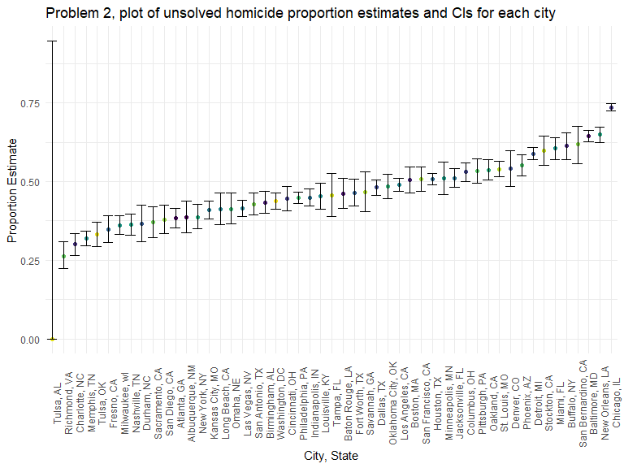

HW5
================
Soungbin Yim
2022-11-15

### Due date

Due: November 16 at 11:59pm.

### Points

| Problem         | Points    |
|:----------------|:----------|
| Problem 0       | 20        |
| Problem 1       | –         |
| Problem 2       | 40        |
| Problem 3       | 40        |
| Optional survey | No points |

### Problem 0

This “problem” focuses on structure of your submission, especially the
use git and GitHub for reproducibility, R Projects to organize your
work, R Markdown to write reproducible reports, relative paths to load
data from local files, and reasonable naming structures for your files.
This was not prepared as a GitHub repo.

``` r
library(tidyverse)
```

## Problem 2

``` r
homicide_df =
  read_csv("./homicide-data.csv") %>%
  mutate(
    victim_age = as.numeric(victim_age),
    city_state = str_c(city, ", ", state)
  ) %>%
  group_by(city_state) %>%
  summarize(unsolved_sum = sum(disposition == "Closed without arrest", disposition == "Open/No arrest"),
    total_homicide = n()) 
```

    ## Rows: 52179 Columns: 12
    ## ── Column specification ────────────────────────────────────────────────────────
    ## Delimiter: ","
    ## chr (9): uid, victim_last, victim_first, victim_race, victim_age, victim_sex...
    ## dbl (3): reported_date, lat, lon
    ## 
    ## ℹ Use `spec()` to retrieve the full column specification for this data.
    ## ℹ Specify the column types or set `show_col_types = FALSE` to quiet this message.

``` r
baltimore_df = 
  homicide_df %>%
  filter(city_state %in% c("Baltimore, MD"))

Prop_baltimore_df =
  prop.test(baltimore_df$unsolved_sum,baltimore_df$total_homicide,
    alternative = c("two.sided"),
    conf.level = 0.95, correct = TRUE) %>%
  broom::tidy()

Prop_baltimore_df %>%
  select(estimate, "CI_lower" = conf.low, "CI_upper" = conf.high)
```

    ## # A tibble: 1 × 3
    ##   estimate CI_lower CI_upper
    ##      <dbl>    <dbl>    <dbl>
    ## 1    0.646    0.628    0.663

``` r
 prop.test(homicide_df$unsolved_sum,homicide_df$total_homicide,
    alternative = c("two.sided"),
    conf.level = 0.95, correct = TRUE) %>%
  broom::tidy()
```

    ## # A tibble: 1 × 56
    ##   estimate1 estimate2 estimate3 estima…¹ estim…² estim…³ estim…⁴ estim…⁵ estim…⁶
    ##       <dbl>     <dbl>     <dbl>    <dbl>   <dbl>   <dbl>   <dbl>   <dbl>   <dbl>
    ## 1     0.386     0.383     0.646    0.462   0.434   0.505   0.612   0.300   0.736
    ## # … with 47 more variables: estimate10 <dbl>, estimate11 <dbl>,
    ## #   estimate12 <dbl>, estimate13 <dbl>, estimate14 <dbl>, estimate15 <dbl>,
    ## #   estimate16 <dbl>, estimate17 <dbl>, estimate18 <dbl>, estimate19 <dbl>,
    ## #   estimate20 <dbl>, estimate21 <dbl>, estimate22 <dbl>, estimate23 <dbl>,
    ## #   estimate24 <dbl>, estimate25 <dbl>, estimate26 <dbl>, estimate27 <dbl>,
    ## #   estimate28 <dbl>, estimate29 <dbl>, estimate30 <dbl>, estimate31 <dbl>,
    ## #   estimate32 <dbl>, estimate33 <dbl>, estimate34 <dbl>, estimate35 <dbl>, …
    ## # ℹ Use `colnames()` to see all variable names

``` r
prop_homicide_df =
  homicide_df %>%
  mutate(proportion = purrr::map2(unsolved_sum,total_homicide,prop.test),
         proportion = purrr::map(proportion, broom::tidy)) %>%
  unnest(proportion) %>%
  select(1:4,8,9)

prop_homicide_df %>% 
  ggplot(aes(reorder(city_state,estimate), estimate)) +       
  geom_point(aes(color = city_state)) +
  geom_errorbar(aes(ymin = conf.low, ymax = conf.high)) +
    labs(
    title = "Problem 2, plot of unsolved homicide proportion estimates and CIs for each city ",
    x = "City, State",
    y = "Proportion Estimate") +
   theme(axis.text.x = element_text(angle = 90),
         legend.position = "none")
```

 \##
Problem 3 When designing an experiment or analysis, a common question is
whether it is likely that a true effect will be detected – put
differently, whether a false null hypothesis will be rejected. The
probability that a false null hypothesis is rejected is referred to as
power, and it depends on several factors, including: the sample size;
the effect size; and the error variance. In this problem, you will
conduct a simulation to explore power in a one-sample t-test.

First set the following design elements:

Fix n=30 Fix σ=5 Set μ=0. Generate 5000 datasets from the model

x∼Normal\[μ,σ\]

For each dataset, save μ^ and the p-value arising from a test of H:μ=0
using α=0.05. Hint: to obtain the estimate and p-value, use broom::tidy
to clean the output of t.test.

Repeat the above for μ={1,2,3,4,5,6}, and complete the following:

Make a plot showing the proportion of times the null was rejected (the
power of the test) on the y axis and the true value of μ on the x axis.
Describe the association between effect size and power. Make a plot
showing the average estimate of μ^ on the y axis and the true value of μ
on the x axis. Make a second plot (or overlay on the first) the average
estimate of μ^ only in samples for which the null was rejected on the y
axis and the true value of μ on the x axis. Is the sample average of μ^
across tests for which the null is rejected approximately equal to the
true value of μ? Why or why not?###

#### Generating the dataset

``` r
sim_ttest = function(mu, n=30, sigma=5) {
  
  sim_data = tibble(
    x = rnorm(n = n, mean = mu, sd = sigma),
  )
  
  sim_data =
  t.test(sim_data) %>%
  broom::tidy() %>%
  select(estimate, p.value)
}

sim_results_df = 
  expand_grid(
    mu = 0, 
    iter = 1:5000
  ) %>% 
  mutate(
    estimate_df = map(mu, sim_ttest)
  ) %>% 
  unnest(estimate_df)
```

``` r
sim_ttest = function(mu, n=30, sigma=5) {
  
  sim_data = tibble(
    x = rnorm(n = n, mean = mu, sd = sigma),
  )
  
  sim_data =
  t.test(sim_data) %>%
  broom::tidy() %>%
  select(estimate, p.value)
}

sim_results_df2 = 
  expand_grid(
    mu = 1:6, 
    iter = 1:5000
  ) %>% 
  mutate(
    estimate_df = map(mu, sim_ttest)
  ) %>% 
  unnest(estimate_df)
```

## Make a plot showing the proportion of times the null was rejected (the power of the test) on the y axis and the true value of μ on the x axis. Describe the association between effect size and power.

``` r
sim_results_df2 %>% 
  mutate(
    reject = (sum(p.value < 0.05))/n()) %>%
  ggplot(aes(x = mu, y = reject)) + 
  geom_point() +
  geom_line()
```

 \##
Make a plot showing the average estimate of μ^ on the y axis and the
true value of μ on the x axis. Make a second plot (or overlay on the
first) the average estimate of μ^ only in samples for which the null was
rejected on the y axis and the true value of μ on the x axis. Is the
sample average of μ^ across tests for which the null is rejected
approximately equal to the true value of μ? Why or why not?
